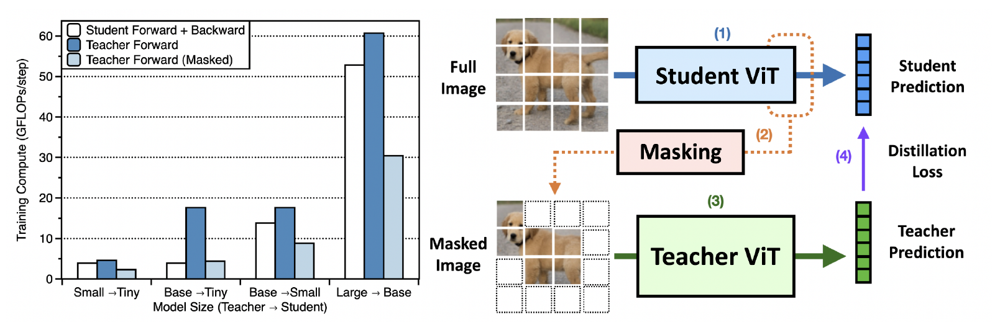

# MaskedKD (Masked Knowledge Distillation)

This is the official implementation of a paper titled "The Role of Masking for Efficient Supervised Knowledge Distillation of Vision Transformers (ECCV 2024)"

### [Paper](https://arxiv.org/abs/2302.10494) | [Project page](https://maskedkd.github.io/)

<br>
Seungwoo Son, Jegwang Ryu, Namhoon Lee, Jaeho Lee <br>
Pohang University of Science and Technology (POSTECH)

## Summary
Our method, MaskedKD, reduces supervision cost by masking teacher ViT input based on student attention, maintaining student accuracy while saving computation.

<center>

</center>

## Installation
Since we have implemeneted on DeiT and MAE's official code, just following MAE's [guideline](https://github.com/facebookresearch/mae).


## Data preparation

Download and extract ImageNet train and val images from http://image-net.org/.
The directory structure is:

```
│path/to/imagenet/
├──train/
│  ├── n01440764
│  │   ├── n01440764_10026.JPEG
│  │   ├── n01440764_10027.JPEG
│  │   ├── ......
│  ├── ......
├──val/
│  ├── n01440764
│  │   ├── ILSVRC2012_val_00000293.JPEG
│  │   ├── ILSVRC2012_val_00002138.JPEG
│  │   ├── ......
│  ├── ......
```

## Experiments

### Training on ImageNet-1K
To train a DeiT-Tiny student with a DeiT3-Small teacher, run:

```sh
python -m torch.distributed.launch --nproc_per_node=8 --use_env main.py \
--model deit_tiny_patch16_224  --teacher_model deit3_small --epochs 300 \
--batch-size 128 --data-path /path/to/ILSVRC2012/ --distillation-type soft \
--distillation-alpha 0.5 --distillation-tau 1  --input-size 224 --len_num_keep 98 \
--output_dir /path/to/output_dir/
```

## Result

|| Teacher  | Student   | Acc@1 |  log                        |
|--------| -------- | --------- | ----- | ----------------------------|
|Logit| DeiT3-Small | DeiT-Tiny | 75.0  | [log](./logs/logit.txt) |
|+MaskedKD<sub>(50%)</sub>| DeiT3-Small | DeiT-Tiny | 75.1  | [log](./logs/maskeded50%.txt) |


## Acknowledgment

This repo is based on [DeiT](https://github.com/facebookresearch/deit), [MAE](https://github.com/facebookresearch/mae) and [pytorch-image-models](https://github.com/rwightman/pytorch-image-models).
